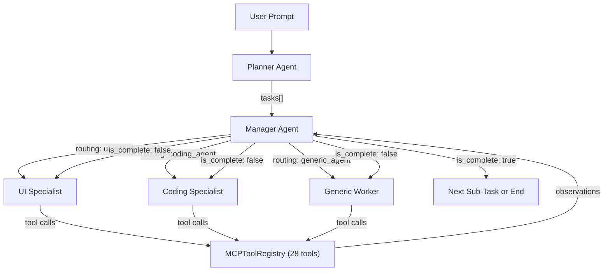

# 🔬 OmniSense AI — Comprehensive Code Audit & SWOT Analysis

**Date**: May 27, 2026  
**Version**: 0.1.0  
**Auditor**: Antigravity AI  
**Perspective**: Building a SOTA AI agent for Unity3D — ease of use, utility, and developer replacement potential.

---

## Table of Contents
1. [Executive Summary](#executive-summary)
2. [Architecture Overview](#architecture-overview)
3. [SWOT Analysis](#swot-analysis)
4. [Detailed Code Quality Report](#detailed-code-quality-report)
5. [Agent Intelligence Assessment](#agent-intelligence-assessment)
6. [Competitive Positioning](#competitive-positioning)
7. [Priority Roadmap](#priority-roadmap)

---

## Executive Summary

OmniSense is an ambitious multi-agent AI orchestration system embedded directly inside the Unity Editor. It uses a **Planner → Manager → Specialist Worker** pipeline to decompose user requests into sub-tasks, route them to the correct specialist agent (UI, Coding, or Generic), execute Unity-native tools via a custom MCP (Model Context Protocol) tool registry, and verify completion through a Manager audit loop.

### Verdict
The architecture is **conceptually strong and differentiated** from any open-source competitor. However, the implementation is at a **functional prototype** stage with several critical engineering debts that must be resolved before it can reliably replace or meaningfully augment a developer's workflow.

| Dimension | Grade | Notes |
|---|---|---|
| **Architecture Design** | A- | Multi-agent hierarchy with routing is genuinely SOTA for Unity plugins. |
| **Code Quality** | C+ | Monolithic files, manual JSON construction, missing error recovery. |
| **Agent Reliability** | C | Death spirals, phantom turns, and context pollution are partially mitigated but not eliminated. |
| **Tool Coverage** | B+ | 28 tools covering files, scene, UI, prefabs, settings. Missing animation, physics setup, material, audio. |
| **UX / Editor Integration** | B | Modern UIElements window with sessions, undo, drag-and-drop. Needs polish. |
| **Security / Safety** | B- | Action approval gate exists. API keys stored in EditorPrefs (plaintext). |
| **Scalability** | C | Single-file orchestrator (2063 lines), history pruning is fragile. |

---

## Architecture Overview



### Core Files

| File | Lines | Bytes | Responsibility |
|---|---|---|---|
| [AIOrchestrator.cs](file:///e:/OmniSense_Unity3D_Plugin/OmniSense_Unity3D_Plugin/Assets/Editor/Omnisense/AIOrchestrator.cs) | 2063 | 118KB | Multi-agent orchestration, API calls, routing, tool dispatch |
| [MCPToolRegistry.cs](file:///e:/OmniSense_Unity3D_Plugin/OmniSense_Unity3D_Plugin/Assets/Editor/Omnisense/MCPToolRegistry.cs) | 1530 | 73KB | 28 MCP tools: file ops, scene manipulation, UI creation |
| [OmnisenseWindow.cs](file:///e:/OmniSense_Unity3D_Plugin/OmniSense_Unity3D_Plugin/Assets/Editor/Omnisense/OmnisenseWindow.cs) | 1068 | 46KB | Editor UI, chat rendering, settings, session management |
| [UnityComponentHelper.cs](file:///e:/OmniSense_Unity3D_Plugin/OmniSense_Unity3D_Plugin/Assets/Editor/Omnisense/UnityComponentHelper.cs) | 241 | 10KB | SerializedProperty + Reflection property setter |
| [OmnisenseUndoManager.cs](file:///e:/OmniSense_Unity3D_Plugin/OmniSense_Unity3D_Plugin/Assets/Editor/Omnisense/OmnisenseUndoManager.cs) | 140 | 4.5KB | Turn-level file backup and undo |
| [OmnisenseSessionManager.cs](file:///e:/OmniSense_Unity3D_Plugin/OmniSense_Unity3D_Plugin/Assets/Editor/Omnisense/OmnisenseSessionManager.cs) | 82 | 2.8KB | Persistent chat session storage |
| [MCPServer.cs](file:///e:/OmniSense_Unity3D_Plugin/OmniSense_Unity3D_Plugin/Assets/Editor/Omnisense/MCPServer.cs) | 228 | 8.2KB | HTTP JSON-RPC server (only 2 routes wired) |

---

## SWOT Analysis

### 💪 Strengths

| # | Strength | Evidence | Impact |
|---|---|---|---|
| S1 | **Multi-Agent Architecture with Specialist Routing** | Planner → Manager → {UI / Coding / Generic} pipeline with dedicated system prompts per agent role. Manager evaluates and re-routes. | This is genuinely differentiated. No competing Unity AI plugin (Muse, Claude MCP, Cursor for Unity) implements multi-agent routing with auditing inside the editor. |
| S2 | **Deep Unity-Native Tool Coverage** | 28 MCP tools covering: file CRUD, scene hierarchy manipulation, component property setting (SerializedProperty + Reflection), prefab workflows, tag/layer management, build/player settings inspection, UI scaffolding (Canvas, Panels, Buttons, Layouts), and screenshot capture. | The agent can perform real, verifiable modifications to the project — not just generate text suggestions. |
| S3 | **Multi-LLM Provider Support** | OpenAI, Anthropic, Gemini, Grok (xAI), and Self-Hosted (Ollama/vLLM) with per-provider JSON formatting and vision payload streaming. | Maximum flexibility. Users aren't locked into one provider. Self-hosted support is a major differentiator for enterprises. |
| S4 | **Robust Safety & Undo System** | Destructive tool calls trigger an approval dialog. `OmnisenseUndoManager` creates file backups per turn, integrates with Unity's native `Undo` system. | Users can fearlessly let the AI work — they can always roll back. This is critical for trust. |
| S5 | **Agent Death Spiral Prevention** | Cognitive loop detector (3 identical responses → halt), redundant tool loop detector (3 identical tool signatures → flush queue), consecutive manager rejection cap (3 → system intervention), phantom turn nudging. | Without these, multi-agent systems universally devolve into infinite loops. These safeguards are essential and well-placed. |
| S6 | **Batch Transaction System** | `scene/execute_transactions` allows the UI agent to fire multiple instantiate/modify/component-add operations in a single tool call. | Reduces token waste and prevents the "trickle update" anti-pattern that kills UI workflows. |
| S7 | **Vision-Assisted UI Development** | `scene/capture_ui_screenshot` with Base64 injection into multi-modal API payloads (OpenAI, Anthropic, Gemini, Grok all handled differently). Two-pass vision protocol enforced by Manager. | The UI agent can actually _see_ what it built. This is a major leap over text-only scene manipulation. |
| S8 | **Persistent Project DNA** | `.omnisense_dna.md` acts as a project-level knowledge base that persists across sessions, injected into every system prompt. | Enables the AI to accumulate project-specific conventions and rules over time — a form of long-term memory. |
| S9 | **Session Management & Auto-Resume** | Chat sessions persist to disk (`UserSettings/OmnisenseHistory/`). After Unity domain reloads (Play mode toggle, script compilation), the orchestrator auto-resumes from `EditorPrefs`. | Seamless developer experience. The AI doesn't "forget" mid-task when Unity recompiles. |
| S10 | **Modern UIElements Editor Window** | Professional chat UI with UXML/USS styling, model selector, drag-and-drop context attachment, copy-chat, stop button, session history, collapsible technical traces. | Feels integrated into Unity, not a bolted-on afterthought. |

---

### 🔴 Weaknesses

| # | Weakness | Severity | Evidence | Recommended Fix |
|---|---|---|---|---|
| W1 | **Monolithic `AIOrchestrator.cs` (2063 lines, 118KB)** | 🔴 Critical | All orchestration, all 5 API provider implementations, all prompt engineering, all tool dispatch, all JSON construction live in one file. | Extract into: `AgentRouter.cs`, `PromptLibrary.cs`, `LLMProviderFactory.cs` (with `ILLMProvider` interface), `ToolDispatcher.cs`. |
| W2 | **Manual JSON String Construction** | 🔴 Critical | Lines 664–696 (OpenAI), 747–779 (Anthropic), 823–855 (Gemini), 899–931 (Grok), 985–1017 (Self-Hosted) all manually concatenate JSON strings with `+` operators. One unescaped character = silent corruption. | Use `JsonUtility.ToJson()` with proper DTOs or Newtonsoft.Json. Build a `IPayloadSerializer` per provider. |
| W3 | **`ChatMessage` Class Name Collision** | 🟡 High | `OmnisenseSessionManager.cs:10` defines `ChatMessage` (with `sender`, `turnId`) and `AIOrchestrator.cs:20` defines its own `ChatMessage` (with `role`, `content`). Both are in the `Omnisense` namespace. This only compiles because they're in separate assembly definitions, but it's a maintenance landmine. | Rename to `SessionMessage` and `LLMMessage` (or similar). |
| W4 | **Shared History Between All Agent Roles** | 🔴 Critical | The Planner, Manager, and all Workers share `_history`. `RefreshSystemContext()` swaps the system prompt at index 0, but all agent responses accumulate in the same list. The Manager sees the Worker's tool observations, and vice versa. This causes "context pollution" — the issue Grok identified in your logs. | Implement isolated histories per agent role. The Manager should only see task descriptions and summaries, not raw tool output. Workers should not see Manager routing queries. |
| W5 | **`MCPServer.cs` is Vestigial** | 🟡 Medium | Only 2 routes are wired (`project/list_directory` and `scene/instantiate_node`). The server exists but is not used by the orchestrator (which calls `MCPToolRegistry` directly). | Either wire all 28 tools into the HTTP server (for external MCP clients) or remove the server to reduce confusion. |
| W6 | **No Streaming / Partial Response Support** | 🟡 High | All API calls use `UnityWebRequest` with full-response mode. For large responses (especially from the Coding agent with boosted tokens), the user sees nothing until the entire response arrives. | Implement SSE streaming for at least OpenAI and Anthropic. Show tokens as they arrive. |
| W7 | **Hardcoded Tool Dispatch Chain** | 🟡 Medium | `ExecuteToolAndResume()` (lines 1692–1905) is a 200-line if-else chain mapping method strings to function calls. Adding a new tool requires editing 3 places: the system prompt, the if-else chain, and the diff summary generator. | Use a `Dictionary<string, Func<MCPToolParams, ToolResult>>` registry pattern. Tools self-register. |
| W8 | **Anthropic/Gemini Response Parsing via Regex** | 🟡 High | Lines 798–799 (Anthropic) and 873–874 (Gemini) use `Regex.Match(resp, "\"text\":\"(.*?)\"")` to extract content. This will break on any response containing escaped quotes or nested JSON. | Parse the full JSON response into typed DTOs. |
| W9 | **No Token Counting / Cost Tracking** | 🟡 Medium | No mechanism to track input/output token usage, estimate API costs, or warn the user when approaching provider limits. | Add token estimation (tiktoken approximation) and display cost in the UI. |
| W10 | **`EditorPrefs` for API Keys** | 🟡 Medium | API keys are stored in `EditorPrefs`, which are plaintext in the Windows registry. | Use Unity's `SettingsScope` + encrypted storage, or at minimum warn the user. |

---

### 🚀 Opportunities

| # | Opportunity | Potential Impact | Effort |
|---|---|---|---|
| O1 | **Animation & Animator Controller Tools** | Missing entirely. Adding `animator/create_controller`, `animator/add_state`, `animator/set_transition` would let the agent build complete animated characters autonomously. | Medium |
| O2 | **Material & Shader Property Tools** | The agent can't create or modify materials. Adding `material/create`, `material/set_property`, `material/set_shader` would cover visual workflows. | Low |
| O3 | **Physics Setup Tools** | Missing `physics/add_collider`, `physics/configure_rigidbody`, `physics/create_joint`. The Coding agent writes physics scripts, but can't configure the physics components themselves. | Low |
| O4 | **Audio Source Tools** | No audio capabilities. `audio/add_source`, `audio/set_clip` would enable the agent to fully wire up game audio. | Low |
| O5 | **Scene Save & Scene Management** | No `scene/save_scene`, `scene/load_scene`, or `scene/create_scene`. The agent can modify scenes but can't manage the scene lifecycle. | Low |
| O6 | **NavMesh & AI Navigation Tools** | For 3D games, pathfinding setup is a common task. `navmesh/bake`, `navmesh/add_agent` would be valuable. | Medium |
| O7 | **Asset Import Pipeline Tools** | Tools to configure import settings (texture max size, mesh compression, audio quality) would let the agent optimize builds. | Medium |
| O8 | **Marketplace / Asset Store as Unity Plugin** | Package as a proper UPM package with `Packages/manifest.json` dependency. Publish to OpenUPM or Unity Asset Store. The `package.json` already exists but isn't wired into UPM distribution. | Medium |
| O9 | **Structured Function Calling** | OpenAI, Anthropic, and Gemini all support native function calling / tool_use. Instead of regex-parsing `mcp_json` blocks from free-text, use the provider's native tool calling API. This would eliminate 90% of parsing failures. | High (but transformative) |
| O10 | **Multi-File Orchestration** | Currently the agent can only read/write one file per tool call. A `project/batch_edit` tool that applies multiple file edits atomically would dramatically speed up coding tasks. | Medium |

---

### ⚠️ Threats

| # | Threat | Severity | Mitigation |
|---|---|---|---|
| T1 | **Unity Muse / Sentis** | 🔴 High | Unity's first-party AI tools are deeply integrated. OmniSense's advantage is multi-agent architecture and provider independence — lean into this. |
| T2 | **Cursor / Windsurf for Unity** | 🟡 Medium | External IDEs can edit C# scripts but can't manipulate the scene hierarchy or UI. OmniSense's scene/UI tools are a moat. |
| T3 | **API Cost Escalation** | 🔴 High | Multi-agent pipelines are inherently token-hungry. A single user request can trigger 5-15 API calls (Planner + Manager routing + Worker turns + Manager audit). Without streaming and token tracking, costs spiral invisibly. |
| T4 | **Death Spiral Reliability** | 🟡 Medium | Despite safeguards, the 3-rejection cap is a blunt instrument. A more intelligent fallback (e.g., switching providers, reducing task granularity, or asking the user for clarification) would be more robust. |
| T5 | **Context Window Limits** | 🟡 Medium | The shared history model means long conversations can exhaust the context window. The pruning logic (lines 1516–1628) is functional but fragile — it can accidentally prune critical tool observations. |
| T6 | **Unity Version Fragmentation** | 🟡 Medium | The plugin targets Unity 2022.3+ but uses APIs like `FindObjectOfType<T>()` which are deprecated in Unity 6+. Future-proofing is needed. |

---

## Detailed Code Quality Report

### File-by-File Assessment

#### 1. AIOrchestrator.cs — Grade: C

**The Good:**
- ReAct loop is well-implemented (Thought → Action → Observation → Reflect)
- Manager-Worker context isolation via `customHistory` parameter for manager queries
- Persistent scratchpad for environmental state tracking
- Smart history pruning with pinned messages (system, DNA, first user prompt, latest sub-task)

**The Bad:**
- **2063 lines in a single file**. This is the #1 engineering debt. The file handles:
  - 5 different LLM provider API implementations (each ~80 lines)
  - 4 agent system prompts (~250 lines total)
  - Full orchestration state machine
  - Tool call extraction and dispatch
  - History management and pruning
  - JSON escaping and serialization
- Manual JSON string construction is fragile and a guaranteed source of silent bugs
- `async void` on `ExecuteToolAndResume` is an anti-pattern (exceptions are swallowed)
- The `while (EditorApplication.isCompiling)` busy-wait loop (line 1893) can freeze the editor

**Critical Bug Risk:**
```csharp
// Line 798 - Anthropic response parsing
var match = Regex.Match(resp, "\"text\":\"(.*?)\"", RegexOptions.Singleline);
```
This regex uses `(.*?)` which is lazy but still matches across the entire response. If the LLM response contains `"text":"` anywhere in its content, this will extract the wrong substring. This is a **data corruption risk**.

#### 2. MCPToolRegistry.cs — Grade: B+

**The Good:**
- Comprehensive tool coverage (28 tools)
- Robust `FindGameObjectDeep` with case-insensitive path resolution and fallback to name-based search
- `FindGameObjectOrPrefab` handles both scene objects and prefab assets with deep path resolution
- `ResolveComponentType` has 3-tier fallback: direct resolution → TMPro/Legacy mapping → fuzzy search
- `ExecuteTransactions` properly handles batched operations with per-operation error tracking
- `SetComponentProperty` handles both scene objects and prefabs (with `PrefabUtility.LoadPrefabContents`)

**The Bad:**
- Some tools have inconsistent error messages
- `CaptureUIScreenshot` uses `ScreenCapture.CaptureScreenshot` which captures the Game View — this requires Play mode or at minimum the Game View to be visible and focused. In Edit mode, this might return a black screen.
- `ListAllNodes` only returns root objects (no hierarchy depth)

#### 3. OmnisenseWindow.cs — Grade: B

**The Good:**
- Professional UIElements implementation with UXML + USS
- Proper message consolidation (same turnId overwrites intermediate UI updates)
- Drag-and-drop context chip system
- Session persistence and restoration
- Auto-resume after domain reload

**The Bad:**
- Several `FindObjectOfType` calls are deprecated in Unity 6
- No markdown or syntax highlighting in chat messages
- Copy-to-clipboard only copies plain text, loses structure

#### 4. UnityComponentHelper.cs — Grade: A-

**The Good:**
- Dual-path strategy: SerializedProperty first (handles undo/prefabs correctly), then Reflection fallback
- Handles `m_` prefix convention automatically
- Supports arrays, enums, vectors, object references
- Object reference resolution uses `FindGameObjectOrPrefab` for maximum flexibility

**Minor Issues:**
- No support for `Color`, `Quaternion`, or `AnimationCurve` types
- No `LayerMask` support

#### 5. OmnisenseUndoManager.cs — Grade: B+

**The Good:**
- Clean turn-based undo with file backup
- Integrates with Unity's native `Undo.PerformUndo()` for scene objects
- Handles both new file creation (delete on undo) and existing file modification (restore from backup)

**The Bad:**
- No cleanup mechanism — backup files accumulate forever in `UserSettings/OmnisenseUndo/`
- No limit on the number of stored turns

---

## Agent Intelligence Assessment

### How Smart is the AI Agent System?

| Capability | Status | Maturity |
|---|---|---|
| Task decomposition | ✅ Working | Planner correctly breaks "create a combat UI" into sub-tasks |
| Specialist routing | ✅ Working | Manager routes UI tasks → UI agent, script tasks → Coding agent |
| Tool execution | ✅ Working | ReAct loop fires tools and feeds observations back |
| Self-verification | ⚠️ Partial | `editor/read_console` for compile errors, `scene/inspect_node` for hierarchy. No visual verification without Play mode. |
| Error recovery | ⚠️ Partial | Manager rejection feedback is injected, but agents often repeat the same failing approach |
| Long-term memory | ✅ Working | `.omnisense_dna.md` persists across sessions |
| Visual understanding | ⚠️ Partial | Screenshot capture works but requires Game View focus and may not work in Edit mode |
| Death spiral prevention | ✅ Working | 3 safeguards in place (loop detector, rejection cap, phantom turn nudge) |

### Key Intelligence Gaps

1. **No "Plan B" on Failure**: When a tool call fails, the agent retries the same approach. It should maintain a fallback strategy library.
2. **No Cost Awareness**: The agent has no concept of how many tokens it's consuming. It can't self-optimize for efficiency.
3. **No Compilation Feedback Integration**: After writing a script, the agent checks `editor/read_console`, but there's no structured way to feed compile errors back into the editing strategy (e.g., "the error is on line 15, the issue is a missing using directive").
4. **No Test Execution**: The agent can't run unit tests or play-mode tests to verify behavioral correctness.

---

## Competitive Positioning

| Feature | OmniSense | Unity Muse | Cursor (Unity) | Claude MCP (Generic) |
|---|---|---|---|---|
| Multi-agent routing | ✅ Planner + Manager + 3 Workers | ❌ Single agent | ❌ Single agent | ❌ Single agent |
| Scene manipulation | ✅ 28 native tools | ✅ Deep integration | ❌ Code only | ⚠️ Via MCP server |
| UI building | ✅ Canvas, Panels, Buttons, Layouts | ⚠️ Limited | ❌ | ❌ |
| Multi-LLM support | ✅ 5 providers + self-hosted | ❌ Unity AI only | ❌ Cursor AI only | ❌ Anthropic only |
| Visual verification | ✅ Screenshot capture | ❌ | ❌ | ❌ |
| Undo system | ✅ Turn-level file + scene undo | ⚠️ Scene only | ❌ | ❌ |
| In-editor chat | ✅ Full UIElements window | ✅ | ❌ External IDE | ❌ External |
| Session persistence | ✅ | ❌ | ❌ | ❌ |
| Batch transactions | ✅ | ❌ | ❌ | ❌ |
| Streaming responses | ❌ | ✅ | ✅ | ✅ |
| Native function calling | ❌ (regex parsing) | ✅ | ✅ | ✅ |

**OmniSense's Unique Moat**: The combination of multi-agent routing + deep Unity-native tool coverage + multi-LLM support + visual verification + in-editor undo is genuinely unique. No competitor offers all of these simultaneously.

---

## Priority Roadmap

### Phase 1: Stability & Reliability (Weeks 1-3)
> Make what exists work reliably before adding new features.

| Priority | Task | Impact |
|---|---|---|
| P0 | **Refactor AIOrchestrator.cs** — Extract LLM providers into `ILLMProvider` implementations, prompts into `PromptLibrary.cs`, tool dispatch into `ToolDispatcher.cs` | Maintainability, testability |
| P0 | **Replace manual JSON construction** with proper serialization (Newtonsoft.Json or custom DTOs) | Eliminates silent data corruption |
| P0 | **Implement isolated agent histories** — Manager and Workers should not share the same message list | Eliminates context pollution and death spirals |
| P1 | **Fix Anthropic/Gemini response parsing** — Replace regex with proper JSON deserialization | Reliability |
| P1 | **Implement native function calling** for at least OpenAI (`tools` parameter) | Eliminates regex tool extraction failures |

### Phase 2: Developer Experience (Weeks 3-5)
> Make it feel premium and trustworthy.

| Priority | Task | Impact |
|---|---|---|
| P1 | **Add SSE streaming** for OpenAI and Anthropic | Users see progress in real-time |
| P1 | **Token counting and cost display** in the UI | Cost transparency |
| P2 | **Markdown rendering** in chat messages (code blocks, bold, headers) | Professional feel |
| P2 | **Wire MCPServer.cs to all 28 tools** or remove it | Clean architecture |
| P2 | **Add undo backup cleanup** (keep last N turns, purge old backups) | Disk hygiene |

### Phase 3: Tool Coverage Expansion (Weeks 5-8)
> Make the agent capable of building complete games.

| Priority | Task | Impact |
|---|---|---|
| P1 | **Material/Shader tools** | Visual workflows |
| P1 | **Animation/Animator tools** | Character workflows |
| P2 | **Physics configuration tools** | Gameplay workflows |
| P2 | **Scene management tools** (save, load, create) | Multi-scene workflows |
| P2 | **Audio tools** | Complete game audio |
| P3 | **NavMesh tools** | AI navigation |

### Phase 4: Intelligence Upgrades (Weeks 8-12)
> Make the agent genuinely smart.

| Priority | Task | Impact |
|---|---|---|
| P1 | **Structured compile error feedback** — Parse error messages, extract line numbers, feed back to coding agent | Self-healing code |
| P2 | **Play mode test execution** — Agent can run tests and read results | Behavioral verification |
| P2 | **Cost-aware planning** — Planner estimates token cost before executing | Prevents bill shock |
| P3 | **Multi-file batch edit tool** | Faster coding tasks |
| P3 | **Fallback strategy library** — On 2nd rejection, agent tries alternative approach | Smarter recovery |

---

> [!IMPORTANT]
> **The single most impactful change** is refactoring `AIOrchestrator.cs` into separate files with isolated agent histories. This would simultaneously fix the death spiral problem, improve maintainability, and make every future feature easier to implement.

> [!TIP]
> **The single highest-ROI new feature** is implementing native function calling (OpenAI `tools` API). This would eliminate all regex-based tool extraction, reduce parsing failures to near-zero, and unlock parallel tool execution in the future.
