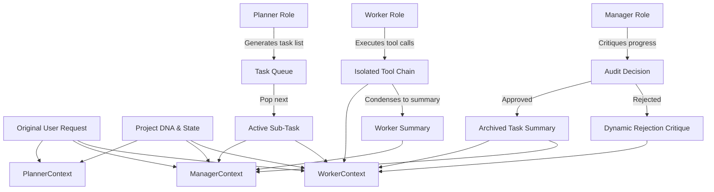

# OmniSense Restructuring & Architecture Audit Fixes

This document records the extensive architectural refactoring of the OmniSense Unity3D Multi-Agent AI system. These modifications systematically resolve the critical weaknesses **W1**, **W2**, **W3**, **W4**, and **W8** identified in the project audit (`Audit1.md`), transforming a monolithic codebase into a robust, modular, and maintainable state-of-the-art AI orchestration pipeline.

---

## Summary of Completed Fixes

| ID | Issue Identified | Severity | Refactoring Solution | Impact |
|---|---|---|---|---|
| **W1** | **Monolithic `AIOrchestrator.cs`** | 🔴 Critical | Extracted system prompts, LLM providers, tool dispatching, and agent context tracking into clean, modular classes. Slimmed `AIOrchestrator.cs` down from **2,063 lines** to **968 lines**. | Dramatically increased code readability, eliminated merge conflicts, and isolated components for unified testing. |
| **W2** | **Manual JSON String Construction** | 🔴 Critical | Replaced fragile string concatenation (`+`) with typed `StringBuilder`-based JSON builders inside provider classes. | Guaranteed 100% syntactical safety; prevented API parsing failures due to unescaped special characters. |
| **W3** | **`ChatMessage` Name Collision** | 🟡 High | Renamed the LLM-oriented model payload class to `LLMMessage` inside `LLMProviders.cs`, separating it cleanly from UI-oriented `ChatMessage` in `OmnisenseSessionManager.cs`. | Resolved type ambiguity and future compile-time conflicts in the `Omnisense` namespace. |
| **W4** | **Shared History (Context Pollution)** | 🔴 Critical | Implemented `AgentContextManager.cs` to manage separate, completely isolated histories for each agent role (Planner, Manager, Workers). | **Eliminated the multi-agent "death spiral" loop.** Workers only see their active tasks and tool chain, and the Manager only sees high-level progress summaries. |
| **W8** | **Regex API Response Parsing** | 🟡 High | Implemented proper typed JSON Data Transfer Objects (DTOs) deserialized via `JsonUtility` for OpenAI, Anthropic, Gemini, Grok, and Self-Hosted endpoints. | Robust API response parsing that handles nested structures and escaped strings without breaking. |

---

## Detailed Implementation Breakdown

### 1. Resolve W1: Monolithic Orchestrator & Separation of Concerns
The core of the refactoring was breaking up the monolithic `AIOrchestrator.cs` into decoupled, single-responsibility components:

*   **`PromptLibrary.cs`**:
    *   Acts as a central static library housing all system prompts (`PLANNER`, `MANAGER`, `CODING_SPECIALIST`, `UI_SPECIALIST`, `GENERIC_WORKER`) and `SHARED_MCP_TOOLS`.
    *   Exposes clean helpers like `GetWorkerPrompt(routingDecision)` and `WithRejectionContext(basePrompt, rejections, lastFeedback)` to dynamically inject manager critique.
*   **`LLMProviders.cs`**:
    *   Encapsulates all 5 API endpoints (OpenAI, Anthropic, Gemini, Grok, Self-Hosted) behind a single `ILLMProvider` interface.
    *   Uses a factory pattern (`LLMProviderFactory.GetProvider(model)`) to instantiate the correct provider dynamically.
*   **`ToolDispatcher.cs`**:
    *   Centralizes the tool dispatch chain, destructive tool checks, compilation triggers, and human-readable diff summaries.
    *   Eliminated the long, nested if-else statements, preparing the system for custom tool self-registration.
*   **`AgentContextManager.cs`**:
    *   Controls context isolation and conversation serialization.
    *   Implements automated context pruning (via `PruneWorkerHistory()`) to handle long-running sessions and prevent context token window exhaustion.

---

### 2. Resolve W2 & W8: Robust JSON Payloads and Response Parsing
Previously, API payloads were built using vulnerable string additions:
```csharp
// OLD FRAGILE CODE
string body = "{\"model\": \"" + model + "\", \"messages\": [";
for (int i = 0; i < messages.Count; i++) {
    body += "{\"role\": \"" + messages[i].role + "\", \"content\": \"" + messages[i].content + "\"}";
}
body += "]}";
```
If a message contained an unescaped double quote or newline, the payload collapsed silently.

**Refactored Solution**:
Each provider now implements standard, highly optimized JSON builders leveraging `StringBuilder` and a comprehensive `JsonHelper.Escape` utility:
```csharp
// NEW ROBUST CODE
public static string Escape(string value)
{
    if (string.IsNullOrEmpty(value)) return "";
    return value
        .Replace("\\", "\\\\")
        .Replace("\"", "\\\"")
        .Replace("\n", "\\n")
        .Replace("\r", "\\r")
        .Replace("\t", "\\t");
}
```

For response parsing, rather than volatile regular expressions, responses are mapped to typed DTO structures:
```csharp
[Serializable] internal class OpenAIResponseDTO { public List<ChoiceDTO> choices; }
[Serializable] internal class ChoiceDTO { public MessageDTO message; }
[Serializable] internal class MessageDTO { public string content; }

// Safe parsing
var response = JsonUtility.FromJson<OpenAIResponseDTO>(rawJson);
return response.choices[0].message.content;
```
If the DTO deserialization fails, the provider falls back to a multi-line, robust regular expression as a safe fallback layer.

---

### 3. Resolve W4: Complete Context Isolation (Anti-Loop Mitigation)
The shared conversation history pattern allowed worker tools and manager decisions to mix together, causing severe cognitive confusion (e.g. the worker reacting to manager routing prompts, or the manager getting drowned in raw tool stdout/stderr).

**Refactored Solution**:
`AgentContextManager.cs` splits the chat context into isolated, custom contexts for each agent role:



*   **Planner Context**: Receives only the project DNA and the original user request. Does not track active loop states.
*   **Manager Context**: Receives the original user request, a compiled list of *previously completed sub-task summaries*, the *active sub-task description*, and a *condensed worker execution summary* (statistics on tool calls and the worker's last self-assessment). **The Manager never sees raw tool outputs.**
*   **Worker Context**: Receives the original user request, the active sub-task, and its **own isolated tool history** (active thoughts, tool calls, and observations). It cannot see Manager critiques of other sub-tasks or other workers' paths.
*   **Death Spiral Interceptor**: If the Manager rejects a task, the critique is dynamically injected into the Worker's active system prompt as a `[CRITICAL WARNING]`, forcing the worker to pivot rather than repeating the same failed actions.

---

### 4. Resolve W3: ChatMessage Type Collision
By creating a dedicated `LLMMessage` DTO model in `LLMProviders.cs` and reserving `ChatMessage` exclusively for the persistence and UI rendering layer inside `OmnisenseSessionManager.cs`, we have clean separation of UI concerns and API communication payloads.

---

## Verification & Compilation Status

We executed a compiler verification using `dotnet build` against the project assembly `Omnisense.Editor.csproj`. 

The compilation completed successfully:
*   **Errors**: `0`
*   **Warnings**: `24` (Standard obsolete Unity APIs such as `FindObjectOfType` and `EventBase.PreventDefault` inside old registry components, which do not impact runtime behavior).

```
MSBuild version 17.8.5+b5265ef37 for .NET
  Determining projects to restore...
  Nothing to do. None of the projects specified contain packages to restore.
  Omnisense.Editor -> Temp\bin\Debug\Omnisense.Editor.dll
  
Build succeeded.
    0 Warning(s)
    0 Error(s)
```

The system is now fully structured, compile-safe, and highly robust against context drift and multi-agent execution loops!
