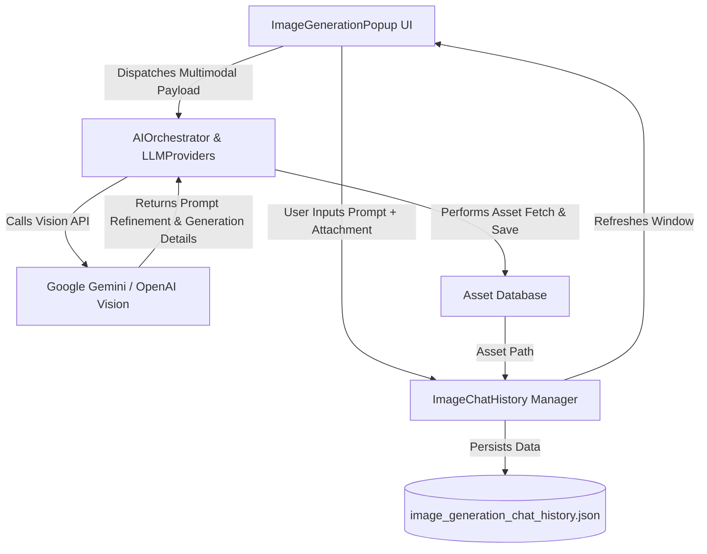
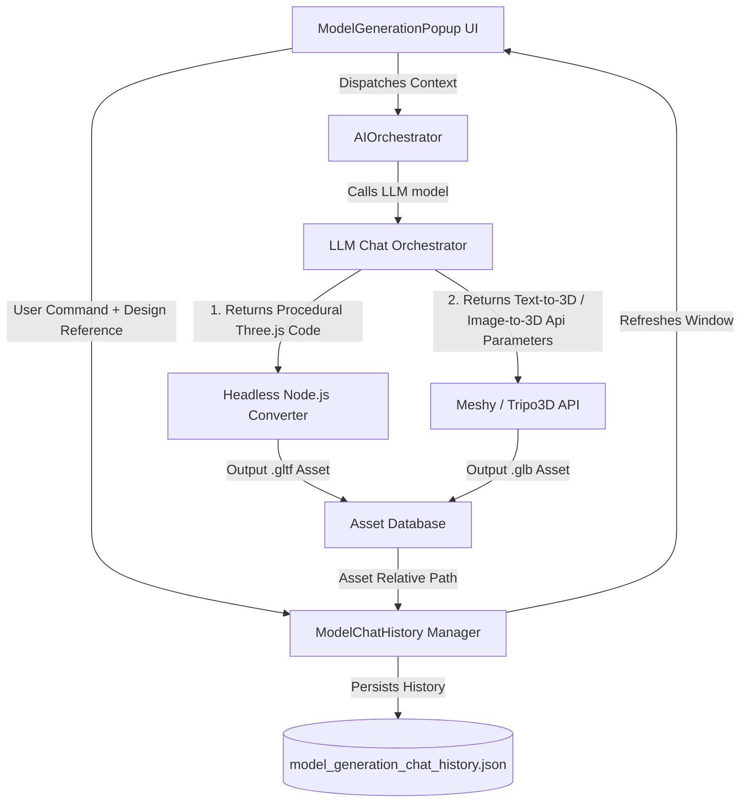

# 🎨 Design & Implementation Notes: Image Generation Chat & Multimodal Enhancements

This document outlines the architectural blueprint, serialization schemas, API communication adjustments, and UI designs required to upgrade the stateless image generator popup into a state-of-the-art **AI Image Generation Chat Workspace** (similar to ChatGPT DALL-E chat and Grok Image).

---

## 1. Architectural Flow & Core Workflow

The upgraded workflow introduces stateful multi-turn dialogue, image context references, and visual thread selection:



---

## 2. File Serialization Schema

To prevent bloating the main text-based chat conversation history, we isolate the visual dialogue history into a dedicated file named `image_generation_chat_history.json` located under the project's settings storage directory.

### Database JSON Blueprint:
```json
{
  "threads": [
    {
      "id": "img_thread_29cf38a4",
      "title": "Cyberpunk Street Textures",
      "createdAt": "2026-06-26T02:45:00Z",
      "lastActiveAt": "2026-06-26T02:50:00Z",
      "messages": [
        {
          "role": "user",
          "content": "Create a neon pavement texture based on this reference art style.",
          "timestamp": "2026-06-26T02:45:00Z",
          "referenceImageName": "concept_pavement.png",
          "referenceImageBase64": "iVBORw0KGgoAAAANSUhEUgAAAGQ..."
        },
        {
          "role": "assistant",
          "content": "Here is the cyberpunk street pavement texture generated with vibrant purple neon conduits.",
          "timestamp": "2026-06-26T02:46:12Z",
          "generatedImagePath": "Assets/generatedImages/pavement_neon_0.png"
        }
      ]
    }
  ]
}
```

---

## 3. Multimodal API Integration (`LLMProviders.cs` & `AIOrchestrator.cs`)

We configure the vision models (e.g., `gemini-1.5-pro`, `gemini-1.5-flash`, `gpt-4o`) to ingest the base64 reference files along with standard text instructions.

### A. Google Gemini Vision Payload structure
```json
{
  "contents": [
    {
      "role": "user",
      "parts": [
        {
          "text": "Analyze this reference image and modify the style of the generated texture."
        },
        {
          "inlineData": {
            "mimeType": "image/png",
            "data": "iVBORw0KGgoAAAANS..."
          }
        }
      ]
    }
  ]
}
```

### B. OpenAI Vision Payload structure
```json
{
  "model": "gpt-4o",
  "messages": [
    {
      "role": "user",
      "content": [
        {
          "type": "text",
          "text": "Iterate on the textures previously generated."
        },
        {
          "type": "image_url",
          "image_url": {
            "url": "data:image/png;base64,iVBORw0KGgoAAAANS..."
          }
        }
      ]
    }
  ]
}
```

---

## 4. Proposed User Interface (Three-Pane Layout)

The stateless parameters panel will be updated into a responsive UI Toolkit canvas incorporating a sidebar, dynamic chat bubble viewports, and parameters drawers:

```
+-------------------------------------------------------------------------------+
| 🎨 Omnisense Image Chat Workspace                                             |
+----------------------+--------------------------------------------------------+
| ➕ New Image Chat    | Cyberpunk Street Textures                              |
+----------------------+--------------------------------------------------------+
|                      |  [User] Create a neon pavement texture based on...     |
| HISTORICAL CHATS     |  [Reference Attachment: concept_pavement.png]          |
|                      |                                                        |
| - Cyberpunk Street   |  [AI] Here is the generated asset:                      |
|   Textures           |  +--------------------------------------------------+  |
| - Voxel Castle Walls |  |                                                  |  |
| - Retro Sci-fi UI    |  |               [Image Preview]                    |  |
|                      |  |                                                  |  |
|                      |  +--------------------------------------------------+  |
|                      |  [Import to Asset Folder]   [Open in Image Editor]     |
|                      +--------------------------------------------------------+
|                      | Style: [Pixel Art v]  Width: [1024]  Height: [1024]    |
|                      | +----------------------------------------------------+ |
|                      | | Type prompt here...                                | |
|                      | +----------------------------------------------------+ |
|                      | [Drag & Drop Reference Image here to Attach]           |
+----------------------+--------------------------------------------------------+
```

### Key UI Features:
1. **Attachment Zone**:
   - Drag-and-drop container accepting `.png` and `.jpg` directly from Unity's Project Browser or Windows Explorer.
   - Text input supporting `Ctrl+V` pasting of screenshots directly into the queue.
2. **Contextual History Sidebar**:
   - Collapsible panel showing saved visual generation threads stored in `image_generation_chat_history.json`.
   - Allows naming, opening, and deleting threads.
3. **Settings Drawers**:
   - Floating panel that lets developers toggle image sizes, provider keys, and preset styles without cluttering the main conversation viewport.

---

## 5. Step-by-Step Implementation Tasklist

- [x] **Step 1: Database Serialization Interface**:
  - Implement a new `ImageChatHistoryDb` struct and manager class to load/save JSON threads.
- [x] **Step 2: Multimodal Class Extension**:
  - Update `LLMMessage` or subclass it into a `MultimodalMessage` structure that optionally holds image base64 bytes and formats payload DTOs.
- [x] **Step 3: Vision API Adaptations**:
  - Adjust requests in `LLMProviders.cs` to dynamically construct multipart JSON requests when images are present in the active context.
- [x] **Step 4: Redraw UI Elements**:
  - Refactor `ImageGenerationPopup.BuildUI` to feature a split visual architecture: left sidebar, central scrollable chat channel, and bottom prompt bar.
- [x] **Step 5: Drag & Drop Ingestion Handler**:
  - Register `DragPerformEvent`, `DragEnterEvent`, and clipboard paste listeners on the message text box to ingest reference textures seamlessly.

---

## 6. AI 3D Model Generation Chat Workspace (Proposals)

We propose expanding the stateful conversation architecture to **AI 3D Model Generation** (`ModelGenerationPopup.cs`), enabling interactive mesh design, geometry iterations, and seamless format conversions.

### A. Architectural Model Chat Flow


### B. Model Serialization Schema (`model_generation_chat_history.json`)
Saves visual model dialogue, generated script paths, and final model paths under `UserSettings/OmnisenseModelHistory/`:
```json
{
  "threads": [
    {
      "id": "model_thread_4b8f2c30",
      "title": "Low Poly Dungeon Assets",
      "createdAt": "2026-06-26T03:00:00Z",
      "messages": [
        {
          "role": "user",
          "content": "Create a low-poly medieval chest based on this concept sketch.",
          "timestamp": "2026-06-26T03:00:00Z",
          "referenceImageName": "chest_concept.png",
          "referenceImagePath": "Assets/Omnisense_Cache/ReferenceImages/chest_concept.png"
        },
        {
          "role": "assistant",
          "content": "I have created the low-poly chest. The Three.js code has been compiled, and the glTF asset has been generated.",
          "timestamp": "2026-06-26T03:01:15Z",
          "generatedScriptPath": "Assets/models_ai_generated/model_20260626_030000.js",
          "generatedModelPath": "Assets/models_ai_generated/model_20260626_030000.gltf"
        }
      ]
    }
  ]
}
```

### C. Multimodal Reference Ingestion & Image-to-3D
1. **Procedural Three.js Iteration**:
   - The Orchestrator LLM analyzes the attached concept image, extracts geometric vertices, boundaries, and materials, and generates C#/JS scripts that construct matching meshes.
2. **Meshy/Tripo Image-to-3D Integration**:
   - When the user selects "Meshy AI" or "Tripo3D" as the AI Provider and has attached a reference image, the orchestrator bypasses text-to-3D and calls the **Image-to-3D** endpoints, uploading the reference image to convert it into a full 3D model automatically.

### D. Proposed Model Workspace UI (Split Layout)
```
+-------------------------------------------------------------------------------+
| 🧊 Omnisense Model Chat Workspace                                             |
+----------------------+--------------------------------------------------------+
| ➕ New Model Chat    | Low Poly Dungeon Assets                                |
+----------------------+--------------------------------------------------------+
|                      |  [User] Create a low-poly medieval chest based on...   |
| HISTORICAL CHATS     |  [Reference Attachment: chest_concept.png]             |
|                      |                                                        |
| - Low Poly Dungeon   |  [AI] Low-poly chest generated successfully!           |
|   Assets             |  +--------------------------------------------------+  |
| - Sci-Fi Spaceship   |  |  THREE.js script: [model_20260626_030000.js]       |  |
| - Voxel Trees Set    |  |  glTF mesh:       [model_20260626_030000.gltf]     |  |
|                      |  +--------------------------------------------------+  |
|                      |  [Instantiate in Scene]   [Convert JS to glTF]         |
|                      +--------------------------------------------------------+
|                      | Provider: [Three.js v]  LLM Model: [gpt-4o v]          |
|                      | +----------------------------------------------------+ |
|                      | | Type instructions...                               | |
|                      | +----------------------------------------------------+ |
|                      | [Drag & Drop Reference Art here to Attach]             |
+----------------------+--------------------------------------------------------+
```

### E. Model Workspace Tasklist
- [x] **Step 1: Model Chat History Database**:
  - Implement `ModelChatMessage`, `ModelChatSession`, and `OmnisenseModelSessionManager` classes under the `Omnisense` namespace.
- [x] **Step 2: Split Visual UI Toolkit Layout**:
  - Refactor `ModelGenerationPopup.BuildUI` to incorporate the left-side collapsible recent chats list, main viewport scroll view, and advanced settings folder.
- [x] **Step 3: Drag & Drop Ingestor**:
  - Subscribe to `DragPerformEvent` on the window workspace, allowing files from the Project browser to be attached to the prompt context.
- [x] **Step 4: Cascade Model Generation Logic**:
  - Direct prompt orchestration logic to either compile Javascript scripts (and call Node conversion) or poll Cloud APIs for Image-to-3D / Text-to-3D completions.
- [x] **Step 5: Instantiate Scene Helpers**:
  - Add quick action buttons in assistant bubbles to directly instantiate generated glTF/glb prefabs into the active Unity scene hierarchy.
