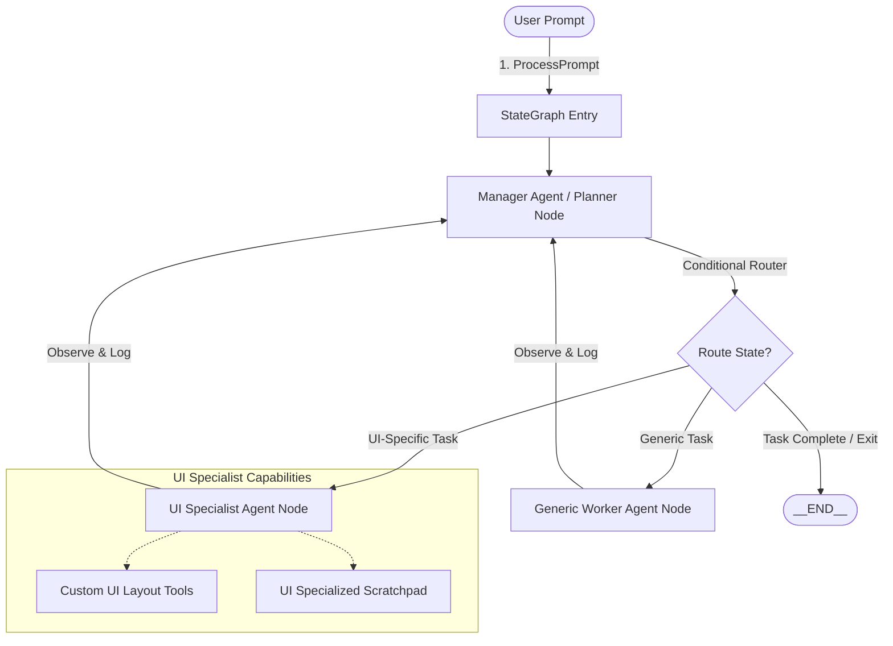
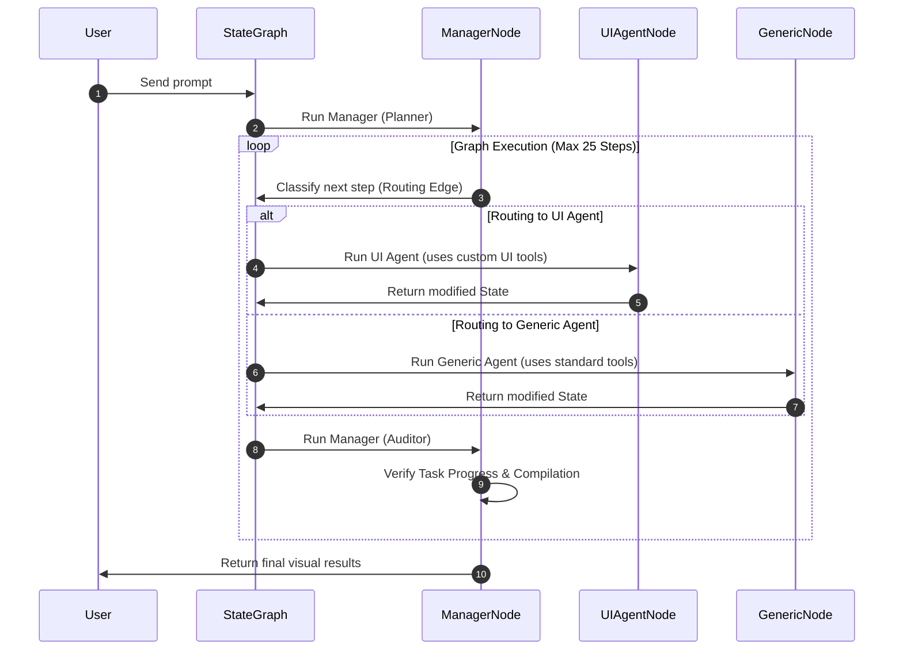

# 🌐 LangGraph Multi-Agent Architecture: SOTA Unity3D Plugin Upgrade

This document outlines the architectural plan and technical design for upgrading the **Omnisense AI Unity3D Plugin** from a sequential ReAct orchestrator into a state-of-the-art **LangGraph-inspired Multi-Agent state machine**. 

By transitioning to a multi-agent graph architecture, we isolate cognitive concerns, eliminate amnesic loops, specialize LLM reasoning budgets, and provide dedicated UI creation tools to our new **UI Specialist Agent**.

---

## 🏗️ 1. Architectural Concept & Core Components

To achieve maximum reliability and zero-dependency compilation inside the Unity Editor, we implement a **native, compiled C# implementation of the LangGraph State Machine**. This keeps our plugin robust, prevents python/npm environment setup issues for users, and compiles directly into the Unity Editor assembly.



### 1.1 The State Graph (`StateGraph`)
The `StateGraph` manages nodes, static edges, and conditional routing functions. It maintains the core operational loop:
*   **State (`AgentState`)**: A state object passed between nodes that is fully serializable and persisted using Unity's `EditorPrefs`.
*   **Nodes**: Functions or sub-systems that accept the `AgentState`, execute prompts/tools, modify the state (e.g. append messages, update logs), and return it.
*   **Edges**: Rules connecting nodes.
*   **Conditional Edges**: Dynamic routing decisions based on LLM outputs evaluated by the Manager Node.

### 1.2 Agent Specialization Topology
We define three core agents:

| Agent Role | Responsibility | Custom Tools | Specialized System Prompts |
| :--- | :--- | :--- | :--- |
| **Manager Agent** | Orchestrates, plans subtasks, routes control, performs quality audits, and decides when the overall query is complete. | *Internal State Router* | High-level system architect, evaluator, and routing logic controller. |
| **Generic Worker** | Legacy agent; handles scripting, folder searches, build configuration, asset lookup, and non-UI Unity hierarchy. | Standard MCP tools (`project/*`, `scene/modify_node`) | Code design patterns, architecture rules, and C# compilation fixer guidelines. |
| **UI Specialist** | Creates and configures responsive, modern Unity Canvas UI, menus, layouts, and wiring. | Custom UI suite (`ui/setup_canvas`, `ui/create_button`, etc.) | Advanced UI/UX layout rules, Canvas Scaling, TextMeshPro sizing, and anchoring rules. |

---

## 🧠 2. Agent State Design (`AgentState`)

The state object `AgentState` contains all data flowing through the multi-agent graph. This structure guarantees that historical context and persistent memories are passed seamlessly between agent nodes:

```csharp
[Serializable]
public class AgentState
{
    public string currentTurnId;
    public string selectedModel;
    public string lastActiveAgent;
    
    // Core memory and history
    public List<ChatMessage> chatHistory;
    public List<string> pendingTasks;
    public string currentTask;
    public int stepCount;
    
    // Logs and diagnostic tracing
    public List<string> actionHistory;
    public List<string> turnContextLog;
    public List<string> persistentScratchpad;
    
    // Agent-specific persistent memory
    public string uiMemoryScratchpad;
    public string genericMemoryScratchpad;
    
    // Router Control Fields
    public string routingDecision; // "generic", "ui", "end"
    public string managerFeedback;
}
```

---

## 🛠️ 3. Specialized Custom UI Tools Registry

To eliminate failure modes where agents make granular, single-component edits to wire basic UI (which often causes scene failures or index errors), we introduce **high-level, robust UI tools** inside `MCPToolRegistry.cs`:

### 3.1 `ui/setup_canvas`
Autonomously instantiates a standard scaling Canvas and EventSystem in the scene if they do not exist:
*   Creates a canvas root with `CanvasScaler` configured to **Scale With Screen Size** (Reference Resolution: `1920x1080`, Match: `0.5`).
*   Adds `GraphicRaycaster` for input support.
*   Instantiates a standard `EventSystem` with `StandaloneInputModule`.

### 3.2 `ui/create_panel`
Creates a beautiful UI Panel container under a specified Canvas or parent:
*   Attaches `RectTransform`, `CanvasRenderer`, and `UnityEngine.UI.Image`.
*   Applies flexible anchoring (e.g. stretch-fill or centered) and presets.

### 3.3 `ui/create_text`
Creates an optimized TextMeshPro UGUI component (with safe legacy UI Text fallback if TMPro package is not installed):
*   Automatically configures font sizes, vertical/horizontal alignment, and anchoring.

### 3.4 `ui/create_button`
Creates a standardized, beautiful button:
*   Autonomously sets up the button hierarchy: Parent button `GameObject` with `Image` & `Button` components + Text child object.
*   Pre-configures button transition colors (normal, hovered, pressed).

### 3.5 `ui/setup_layout_group`
Instantiates and configures layout group components (`HorizontalLayoutGroup`, `VerticalLayoutGroup`, or `GridLayoutGroup`):
*   Configures padding, spacing, child alignment, and control height/width toggles.

---

## 📈 4. Multi-Agent Graph Implementation Flow



1.  **Orchestrator Entry**: `AIOrchestrator.cs` captures the prompt, deserializes the last state, and initializes the `StateGraph`.
2.  **Manager Planning**: The Manager Node evaluates the user request and divides it into tasks. It determines which specialized agent is needed first and updates `AgentState.routingDecision`.
3.  **Specialist Execution**: Control is routed to the designated specialist (UI Agent or Generic Worker). The specialist receives a highly targeted system prompt specifying its domain and is allowed to run its specialized tool set.
4.  **Manager Evaluation & Feedback**: The specialist yields control back to the Manager Node. The Manager checks for Unity console compilation errors (`editor/read_console`), reviews changes, and decides whether to transition to the other specialist, loop back, or exit.
5.  **Completion**: The graph terminates when the Manager evaluates the subtasks as complete and routes to the special `__end__` state.

---

## 🚀 5. Detailed Implementation Tasks

We will implement this SOTA multi-agent enhancement via the following structured stages:

1.  **Define C# `StateGraph` Classes**: Implement lightweight graph routing primitives (`StateGraph`, `StateNode`, `StateEdge`, `ConditionalStateEdge`) at the bottom of `AIOrchestrator.cs`.
2.  **Create Agent Node Logic**:
    *   Implement `RunManagerNode` for planning and auditing.
    *   Implement `RunUIAgentNode` with dedicated UI system guidelines.
    *   Implement `RunGenericAgentNode` to wrap standard operations.
3.  **Implement High-Level UI Tools**: Add `SetupCanvas`, `CreateUIPanel`, `CreateUIText`, `CreateUIButton`, and `SetupLayoutGroup` inside `MCPToolRegistry.cs`.
4.  **Wire MCPServer Tool Routes**: Connect new UI tools inside `AIOrchestrator`'s execution layer so they can be dispatched.
5.  **Refactor `ProcessPrompt` and `Resume`**: Connect the entry points in `AIOrchestrator` to execute the state-graph engine instead of the old sequential planner-worker flow.
6.  **Verify & Compile**: Build the plugin to confirm compilation is clean and there are zero warnings.

Let's begin the implementation immediately!
