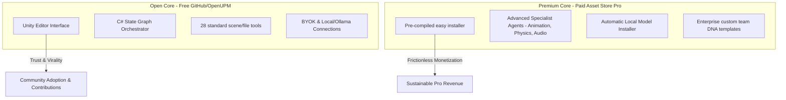
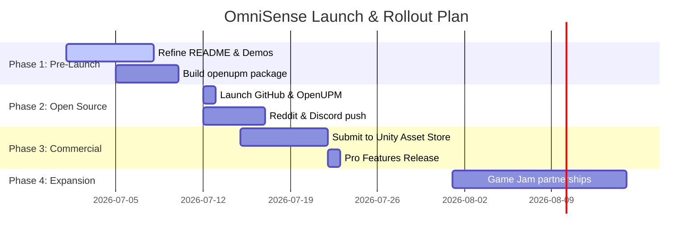

# 🚀 OmniSense AI: Marketing, Rollout & Monetization Plan

OmniSense is a state-of-the-art (SOTA) Multi-Agent AI orchestration engine embedded directly within the Unity Editor. Unlike standard one-shot chat windows, OmniSense uses a native C# **Planner → Manager → Specialist Worker** state-graph loop to design, implement, and compile complete gameplay features and UI setups autonomously, keeping developers in control via a Deferred Approval system.

This document outlines the strategic marketing, community rollout, and monetization roadmap to launch OmniSense as a highly accessible ("mostly free") but financially sustainable game-development tool.

---

## 🏗️ 1. Competitive Advantage & Positioning

To successfully launch OmniSense, we must highlight what makes it distinct from first-party and general AI tools:

| Dimension | OmniSense | Unity Muse | Cursor / Windsurf | Claude Code / MCP |
| :--- | :--- | :--- | :--- | :--- |
| **Orchestration** | **Multi-Agent State Machine** (Planner Nodes + Auditor Nodes) | Simple Single-Agent Chat | Single-Agent Chat | Single-Agent CLI |
| **Scene Awareness** | **Deep scene & prefab traversal** (active/inactive) | Broad scene search | None (C# scripts only) | Via external MCP bridge |
| **UI Scaffolding** | **Natively wires Canvas, panels, button components** | Manual UI suggestion | None | None |
| **Safety & Trust** | **Deferred turn-level batch review panel & backups** | Instant execution | None (manually accept code) | Interactive CLI |
| **LLM Providers** | **BYOK (Bring Your Own Key)** for 9+ APIs + Self-Hosted | Locked to Unity AI | Locked to subscription | Locked to Anthropic |
| **Asset Generation** | **Integrated 3D model & 2D image generators** | Separate image tools | None | None |

> [!IMPORTANT]
> **Our Unique Value Hook**: *"OmniSense is the only Unity-integrated AI agent that has 'hands' in the hierarchy and 'brains' in script generation, giving you the power of a senior engineer with a complete turn-based undo safety net."*

---

## 🧠 1.1 Comparative Analysis: The New Unity AI Suite vs. OmniSense

With the launch of Unity 6.2, Unity officially retired the standalone "Unity Muse" subscription and introduced **Unity AI**, a deeply integrated, project-aware AI module built directly into the Unity 6 engine. Comparing this native module with OmniSense outlines our strategic advantages:

### A. Hosting, Billing, and Privacy (AI Gateway vs. OmniSense BYOK)
* **Unity AI (AI Gateway)**: Introduced the **AI Gateway** to allow developers to bridge third-party frontier models (like Gemini) into the editor. However, this gateway is still gated behind the Unity Hub account system, requiring active online connections and utilizing a credit-based subscription billing model ($10/month tiers for AI Credits). Furthermore, project structure and metadata are sent to Unity's cloud services for indexing.
* **OmniSense**: Offers complete **Bring Your Own Key (BYOK)** freedom. Devs configure direct connections to their chosen APIs (OpenAI, Anthropic, Gemini, Grok, DeepSeek, Qwen, GLM, Kimi) at direct API cost, with zero billing markups. Additionally, OmniSense natively integrates with local offline runners (Ollama, LM Studio, vLLM) for **100% offline, private, and local execution**—allowing studios with strict IP protections to work securely without cloud exposure.

### B. Workspace Tooling Integration (MCP Server vs. In-Editor Execution)
* **Unity AI (MCP Server)**: Exposes an in-engine **Model Context Protocol (MCP) Server** designed to feed scene hierarchy and asset context to external IDEs (like Cursor or VS Code). While useful, this places the tool configuration and workflow burden on the developer, forcing them to jump back and forth between external editors and the Unity editor to coordinate tasks.
* **OmniSense**: Features a fully integrated docked UI Toolkit window containing a native C# state machine. Instead of relying on external IDE connections, the agent compiles scripts, resolves component properties via reflection, configures layout groups, and creates prefabs natively. It bridges context and execution in a single in-editor environment.

### C. Agentic Autonomy (Assistant Chat vs. Manager-Worker State Graph)
* **Unity AI (Assistant & Generators)**: Features an **AI Assistant** for technical chat and script generation, alongside **Generators** for placeholder assets (textures, sprites, animations, sound). However, the workflow is fundamentally conversational; it lacks multi-step planning, task delegation, and autonomous verification.
* **OmniSense**: Implements a compiled C# **Manager-Worker State Graph** (Planner, Manager, Workers). The Planner breaks complex goals down into atomic sub-tasks; specialized agents (UI, Coding, Generic) execute them; and the Manager audits compile logs and scene structures, self-healing errors dynamically before completing the task.

### D. Verification and Trust (Automatic Execution vs. Deferred Staging)
* **Unity AI**: Generates assets directly or drops scripts in-place, which can disrupt active game states or lead to compile blockages that developers must manually sort out.
* **OmniSense**: Utilizes high-throughput **Batch Transactions** (`scene/execute_transactions`) to apply scene modifications. All changes (file edits, component additions, scene instantiations) are staged in a **Deferred Review Panel**, allowing developers to review, select, apply, or reject changes collectively at the end of the turn with a turn-level undo database.

### E. Integrated 3D Model Generation Pipeline (Three.js vs. Meshy vs. Tripo3D)
* **Three.js Code Generator**: Uses the developer's selected LLM model to write executable JavaScript, converting it to glTF locally using the Node wrapper.
* **Meshy AI & Tripo3D (Dynamic Parameter Settings)**:
  * Resolved the UI issue where selecting `Meshy AI` or `Tripo3D` would display default LLM model names (like `gpt5` / `gpt-5.4-mini`).
  * The second dropdown now dynamically updates based on the **AI Provider** choice:
    * Selecting **Meshy AI** transitions the dropdown label to **"Meshy Style:"** and populates it with Meshy art style selections (`realistic`, `cartoon`, `sculpture`, `voxel`, `poly`), which are sent to the openapi v2 `art_style` parameter.
    * Selecting **Tripo3D** transitions the dropdown label to **"Tripo Version:"** and populates it with Tripo model versions (`v2.5`, `v2.0`, `v1.0`), which are mapped to the task creation `model_version` parameter.
  * The selected AI Provider and model/style preferences are fully persisted using `EditorPrefs` across assembly reloads, and the LLM prompt optimizer runs under a global context, ensuring consistent, high-fidelity text-to-3d generations.

---

## ⚖️ 2. The Distribution Model: Open Core

Given the goal to keep OmniSense **mostly free** while maintaining future commercial viability, the **Open Core** model is the most effective approach.

### Why Open Core works for Game Devs:
1. **Leverages Developer Trust**: Game developers are highly protective of their source code. Open-sourcing the core logic (the state machine, standard tools, and UI) on GitHub fosters trust, security audits, and pull requests.
2. **Encourages Contribution**: Devs will write custom MCP tools (e.g., integrating with popular assets like *Playmaker*, *A* Pathfinding*, or *FMOD*) and pull request them back into the main repo.
3. **Creates a Two-Tier Model**:
   * **OmniSense Core (Free/Open Source)**: Distributed via GitHub/OpenUPM. Target audience: Hobbyists, indie devs, and local AI enthusiasts.
   * **OmniSense Pro (Paid - $29 one-time)**: Distributed via the Unity Asset Store. Target audience: Professional developers who want a single-click setup, auto-updates, and advanced agent extensions.

---

## 📅 3. The 4-Phase Rollout Timeline

### Phase 1: Pre-Launch Polish & Visual Asset Prep (1 Week)
* **Goal**: Prepare clean, high-conversion visual assets that demonstrate the agent's autonomy.
* **Key Tasks**:
  * Create high-fidelity looping GIFs and 30-second videos showing:
    * *The Canvas Scaffolder*: Building a Main Menu UI in 20 seconds.
    * *The Self-Healing Loop*: The AI writing a C# script, getting a compiler warning, and fixing it autonomously before the user sees it.
    * *The Deferred Approval list*: Checking checkboxes to approve scene changes.
  * Structure the codebase into a clean **UPM (Unity Package Manager)** format with a `package.json` file.

### Phase 2: Open-Source Launch (Weeks 1-2)
* **Goal**: Generate initial developer hype, gather GitHub stars, and collect telemetry/feedback.
* **Distribution Channels**:
  * **GitHub**: Host the repository publicly with an MIT license.
  * **OpenUPM**: Register the package so devs can install it by adding a single line to their `Packages/manifest.json`.
* **Outreach Campaign**:
  * **Reddit**: Post on `r/unity3d`, `r/gamedev`, and `r/LocalLLaMA` emphasizing the local/offline capability (connecting to Ollama/LM Studio for zero cost).
  * **Hacker News**: Focus the launch write-up on the C# LangGraph state machine compiling natively in-editor.

### Phase 3: Commercial Transition (Week 3-4)
* **Goal**: Launch the paid Pro version on the Unity Asset Store and begin monetization.
* **Key Tasks**:
  * Package the plugin for the Unity Asset Store.
  * Introduce **Asset Store Pro** features (e.g. advanced Animation controllers, 3D mesh generator overlays, automated Physics setup tools).
  * Launch a YouTube documentation tutorial series.

### Phase 4: Community Growth (Ongoing)
* **Goal**: Turn OmniSense into a standard tooling dependency for Unity development.
* **Tactics**:
  * Sponsor online Game Jams (e.g., GMTK Jam, Ludum Dare) by offering free temporary API keys to participants to speed up prototyping.
  * Launch a community Discord for sharing Custom DNA rules and custom worker agent behaviors.

---

## 📣 4. Target Marketing Channels & Content Strategy

### A. The "Visual Loop" Video Strategy
Game developers are visual buyers. We should produce short, high-energy videos showing real-time scene editing.
* **YouTube Shorts / TikTok / X (Twitter)**:
  * *Hook*: "Unity AI that actually builds your UI."
  * *Video structure*: Start with a blank scene. Ask OmniSense to "make a character selection screen with 3 panels and button links." Speed up the video as the agent populates the scene and C# scripts, concluding with the developer pressing Play to show it working.
* **Technical Blog Posts (Medium / dev.to / GitHub Pages)**:
  * Write about how we solved the **Domain Reload Death Spiral** in Unity editor programming (locking assemblies during the state-graph loop). This establishes deep engineering credibility.

### B. Developer Communities
* **Reddit (`r/unity3d`, `r/gamedev`, `r/LocalLLaMA`)**:
  * Focus on the **local inference angle** (Ollama/Llama3/DeepSeek-Coder) to appeal to the privacy-minded and budget-constrained developers who don't want to pay monthly subscription fees.
* **Discord Communities**:
  * Share the plugin in AI/Game Dev crossover servers (e.g., Unity Developer Group, AI Game Devs).

---

## 💰 5. Revenue & Monetization Options

Even with a "mostly free" approach, we can build sustainable revenue streams:

### Option A: The "Unity Asset Store Pro" License (Recommended)
* **Free Version (GitHub / OpenUPM)**: Includes the complete state machine, LLM connectors (OpenAI, Anthropic, Gemini, Grok, DeepSeek, Qwen, GLM, Kimi, local), and filesystem/scene editing.
* **Pro Version ($29 - Unity Asset Store)**:
  * Includes pre-compiled single-click installation.
  * Adds specialized toolsets for Animators, Audio clips, Physics configurations, and custom navigation meshes (NavMesh).
  * Provides a gallery viewer UI tab to manage all generated images and 3D meshes easily.

### Option B: The "Cloud Bridge" SaaS Model
* **Free / BYOK**: Devs enter their own API keys (paying OpenAI/Anthropic directly).
* **OmniSense Cloud Tier ($9/month)**:
  * A unified API key provided by OmniSense. Devs pay a flat subscription for unified access to Grok, GPT-4o, Claude 3.5 Sonnet, and Google Imagen without managing multiple keys.
  * Offers cloud-based mesh generation (Tripo3D/Meshy) and texture styling templates without setup friction.

### Option C: Enterprise / Studio Licensing
* Custom pricing for game studios requiring:
  * Integration with private company codebases.
  * Proprietary studio DNA guidelines (e.g., enforcing internal scripting style sheets across the team).
  * On-premise secure local AI server configurations.

---

## 📋 6. Launch Action Items Checklist

- [ ] **Final Code Polish**: Verify all custom providers (DeepSeek, Qwen, GLM, Kimi) are working cleanly and the settings tab layout displays nicely.
- [ ] **Create GitHub Repository**: Set up a clean structure containing:
  * `package.json` for Unity Package Manager routing.
  * A clean `README.md` containing the SWOT positioning, installation guides, and visual demo clips.
  * License file (MIT or Open Core dual-license).
- [ ] **Prepare OpenUPM Configuration**: Register `com.omnisense.editor` on OpenUPM.
- [ ] **Submit to Unity Asset Store**: Prepare icons, banners, and package drafts for review.
- [ ] **Record Launch Demos**: Capture 3-4 video demonstrations of the multi-agent planning and deferred approval workflow in action.
