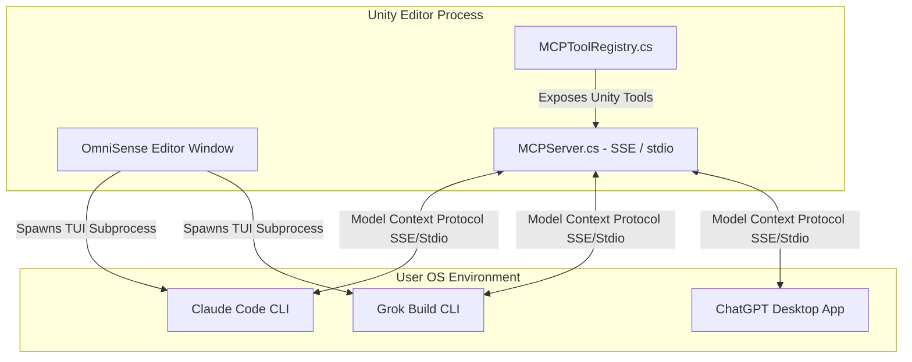

# OmniSense AI: Claude Code, Grok Build, and ChatGPT Integration Research

This document outlines the research, technical feasibility, and architectural design for integrating the OmniSense Unity3D Plugin with three major agentic/coding platforms: **Claude Code** (Anthropic), **Grok Build** (xAI), and **ChatGPT** (OpenAI). 

---

## 1. Executive Summary & Integration Philosophy

Instead of writing custom, proprietary API integration layers for each provider—which introduces code churn, API breakage risk, and complex local client syncing—OmniSense leverages the **Model Context Protocol (MCP)**. 

Since **Model Context Protocol (MCP)** has become the industry-standard "USB-C port" for connecting AI models to data and tools:
1. **Claude Code** natively supports MCP connections out of the box.
2. **Grok Build** supports MCP for custom tools and environment context.
3. **ChatGPT** (Desktop & Developer Web) supports MCP servers to perform local tool calling.

By configuring the OmniSense Unity plugin to expose a standard MCP server interface, any of these external CLI agents or desktop apps can immediately discover, read, and write to the Unity Editor scene and project.

Within the Unity Editor, we will provide dedicated **UI Tabs** for each tool, enabling developers to run their local workflows, trigger authentication, and interact with the CLI agents directly inside Unity.



---

## 2. Platform Deep-Dive & Authentication Analysis

### A. Claude Code (Anthropic)
*   **What it is:** A terminal-native, autonomous coding agent CLI (`claude`) powered by Claude 3.5/3.7 models. It operates locally, reads/writes code, executes terminal commands, and handles git diffs.
*   **MCP Support:** Full native support. Claude Code stores configuration files on disk and exposes a CLI command to link servers:
    ```bash
    claude mcp add omnisense --transport sse http://localhost:3000/sse
    ```
*   **Authentication Flow:**
    1. The user runs `claude login`.
    2. The CLI launches the default browser, redirecting the user to Anthropic's OAuth portal.
    3. Upon logging in via the web browser, an authorization token is returned and stored locally (typically in `~/.config/claude/` or as environment tokens).
    4. Subsequent CLI operations use this local token.

### B. Grok Build (xAI)
*   **What it is:** xAI's open-source, terminal-native autonomous coding agent. It specializes in multi-file planning, executing git worktree forks in parallel, and self-healing.
*   **MCP Support:** Full support. Grok Build is compatible with standard MCP specs and reads configurations to ingest local workspace tools.
*   **Authentication Flow:**
    1. The user logs in via `grok login` or sets the environment variable `XAI_API_KEY`.
    2. The login command triggers a web-based authentication flow to verify the user's xAI console subscription.
    3. The token is cached locally under xAI's config directories.

### C. ChatGPT (OpenAI)
*   **What it is:** OpenAI's chat platform (formerly Codex is now fully integrated into the GPT-4/GPT-4o series and specialized coding system APIs).
*   **MCP Support:** The ChatGPT Desktop app supports local MCP servers via **Settings > MCP Servers** (registered via a local configuration JSON file). The Web interface supports HTTP/SSE servers (requiring an HTTPS tunnel like `ngrok` if running locally).
*   **Authentication Flow:**
    1. **Web App:** Uses standard browser cookies/tokens. Exposing local MCP tools requires a secure HTTPS tunnel and registering the URL in the ChatGPT custom developer settings.
    2. **Desktop App:** Uses the desktop app session. It reads a local `chatgpt-config.json` configuration file to spawn local stdio processes or query local SSE servers.

---

## 3. Implementing the Local MCP Server

Our current `MCPServer.cs` hosts a basic HTTP server parsing JSON-RPC on port `3000`. To achieve compatibility with the three targets, we will upgrade it to support the two standard MCP transport layers:

### 1. SSE Transport (Server-Sent Events)
Perfect for Web-based ChatGPT, local Desktop apps, and CLI servers. It uses standard HTTP paths:
*   `GET /sse`: Sets up the server-sent events stream where the client receives tool execution events.
*   `POST /messages`: Where the client posts tool-call requests.

### 2. Stdio Transport
Perfect for CLI connections (Claude Code and Grok Build). We will create a tiny standalone Node or Python wrapper script inside `UserSettings/Omnisense_3D_Helpers/` that connects stdin/stdout to our Unity HTTP server. External clients run:
```bash
claude mcp add omnisense -- node UserSettings/Omnisense_3D_Helpers/mcp-bridge.js
```

---

## 4. Unity In-Editor Tab Architecture

To integrate these tools directly into the Unity editor, we will add three dedicated tabs to the **OmniSense AI Chat Workspace**:

```
+-----------------------------------------------------------------------+
| ⚙ Generation Parameters                                               |
+-----------------------------------------------------------------------+
|  [ Chat ]   [ Claude Code ]   [ Grok Build ]   [ ChatGPT ]            |
+-----------------------------------------------------------------------+
|                                                                       |
|  Status: Claude Code authenticated.                                   |
|                                                                       |
|  $ claude "add a character controller to the Player object"            |
|  > Planning task...                                                   |
|  > Checking Unity hierarchy...                                       |
|  > Staging CharacterController.cs                                     |
|                                                                       |
|  [ Stop Agent ]                                     [ Open Browser ]  |
+-----------------------------------------------------------------------+
```

### 1. Process Spawning & Terminal UI
Since Claude Code and Grok Build are TUI (Terminal User Interface) applications, we can spawn them using C#'s `System.Diagnostics.Process`:
*   Redirect `StandardInput`, `StandardOutput`, and `StandardError`.
*   Parse ANSI escape sequences to display colored text and layout widgets inside a Unity UI Toolkit `ScrollView` or a custom ImGui element.
*   Forward user keyboard input directly to the process's standard input.

### 2. Dynamic Authentication Management
For each tab, the plugin will perform a pre-flight check to see if the CLI tools are authenticated:
*   **Checking Login Status:** Run a fast check command (e.g. `claude keys` or checking if `~/.config/claude/` contains valid session keys).
*   **Triggering Login:** If the CLI returns a "not authenticated" state, show a prominent **"Authenticate [Tool Name]"** button. Clicking this button will:
    1. Spawn the command-line login process (e.g., `claude login` or `grok login`).
    2. Automatically open the system web browser pointing to the OAuth login page.
    3. Wait asynchronously in the background for the token file to be written to disk.
    4. Automatically reload the tab workspace once authentication completes!

### 3. Exposing Unity context dynamically
When the user runs Claude Code or Grok Build, we can auto-inject environment parameters containing our active local port:
```csharp
process.StartInfo.EnvironmentVariables["OMNISENSE_MCP_URL"] = "http://localhost:3000/sse";
```
This enables the spawned CLI to automatically register our MCP tools without forcing the user to configure paths manually.

---

## 5. Implementation Roadmap

1.  **Phase 1: Standardize MCP Server**
    *   Rewrite [MCPServer.cs](file:///e:/OmniSense_Unity3D_Plugin/OmniSense_Unity3D_Plugin/Assets/Editor/Omnisense/MCPServer.cs) to handle full SSE and stdio JsonRpc standards.
    *   Expose all functions in [MCPToolRegistry.cs](file:///e:/OmniSense_Unity3D_Plugin/OmniSense_Unity3D_Plugin/Assets/Editor/Omnisense/MCPToolRegistry.cs) as standard schemas.
2.  **Phase 2: CLI Bridges & Command Wrappers**
    *   Develop a JS/Python bridge script to translate command line `stdio` into our active local HTTP port.
3.  **Phase 3: Unity Editor Tab Layout**
    *   Add tabs to [OmnisenseWindow.uxml](file:///e:/OmniSense_Unity3D_Plugin/OmniSense_Unity3D_Plugin/Assets/Editor/Omnisense/OmnisenseWindow.uxml).
    *   Implement terminal logging and input redirection in [OmnisenseWindow.cs](file:///e:/OmniSense_Unity3D_Plugin/OmniSense_Unity3D_Plugin/Assets/Editor/Omnisense/OmnisenseWindow.cs).
4.  **Phase 4: Automatic Discovery & Authentication**
    *   Implement file watchers for `~/.config/claude/` and `~/.config/grok/` to track login state and update the UI in real-time.
